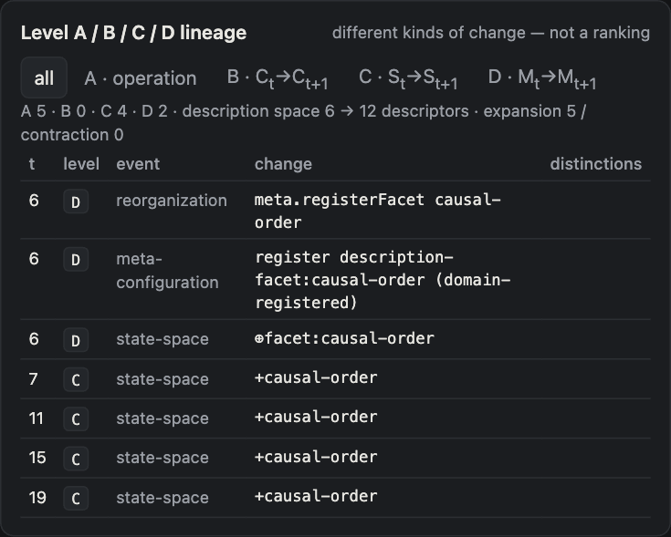
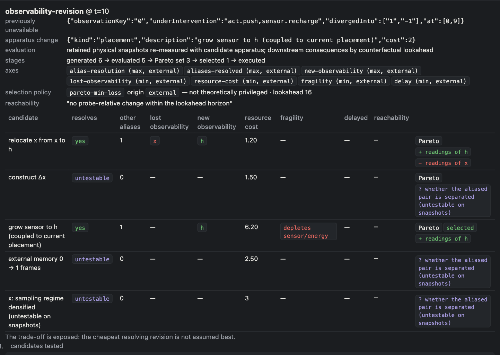

# Ziran / Xeno Operational World Simulator

**Operational-Shape Dynamics, Observability Generation, and Description-Space Reorganization** · v0.3.0 · open research prototype

Repository: https://github.com/n-fujie/ziran-xeno-simulator · Author: Naoto Fujie · License: MIT

Ziran / Xeno Operational World Simulator is an experimental framework for studying how operational differences
ignite under configuration-dependent conditions, alter downstream reachability, penetrate across coupled
configurations, and reorganize observation and description systems.

The current release supports explicit analysis of configuration reorganization, description-space transformation,
and partially revisable meta-configuration. Its benchmark results are synthetic and are not empirical validation of
the underlying theoretical framework.

## 1. What this project is

An executable environment for tracking configured operational differences, observability revision, downstream
reachability, penetration, feedback, reorganization, description-space change, and explicit meta-boundedness.

It can compare how results change when observation systems, variable systems, grammars, trace schemas, category
features, evaluation axes, or benchmark predicates change.

Everything it reports carries a claim status (see [docs/claims.md](docs/claims.md)): *implementation property*,
*synthetic-world result*, *model-class discrimination*, *reconstruction inference*, *replayed empirical result*,
*empirical observation*, *empirically supported generalization* or *unresolved*. No result in this release is an
empirical observation or an empirically supported generalization.

## 2. What it is not

- not a completed implementation of the Ziran / Xeno framework, and not a proof of it;
- not an empirically validated theory — all bundled worlds are synthetic;
- not an unrestricted autonomous-science system — variables come from a supplied grammar or from a grammar that
  changes through supplied meta-operations;
- not an ontology-free or presupposition-free simulator — it exposes and partially revises some presuppositions, it
  does not remove them;
- not a historical-person simulator — historical material enters only as *historically constrained operational
  reconstruction* with sources, assumptions, uncertainty and `historicalFactualClaim: false`;
- not a claim of general superiority over existing modeling approaches (a comparison is future work, §10).

Categories (human, agent, trader, body, …) are not removed as a goal. They are kept out of the core and introduced
where they produce non-redundant operational differences; the benchmarks show cases where a thick category is
useful (J) and where it is redundant (K).

## 3. Core analytical sequence

```
C_t → Δ_t → ignition → operation → real effect → penetration → feedback → reorganization → C_{t+1}
```

A configuration `C_t` makes some differences `Δ_t` operational; configured ignition conditions select operations;
only actual differences are recorded as real effects; effects penetrate other configurations along couplings
(transformed, delayed, lost); feedback modifies the conditions that were read; reorganization changes the
configuration. Observation is a separate apparatus: "not detected" is never read as "absent".

## 4. A / B / C / D

**A/B/C/D are not ontological strata. They are revisable analytical distinctions used to localize different forms
of operational change.** A higher letter does not mean deeper reality, a superior explanation, or a more advanced
intelligence.

| | name | recorded as |
|---|---|---|
| **A** | operation within a configuration | real effects inside `C` |
| **B** | configuration reorganization | `C_t → C_{t+1}` within the same description space |
| **C** | description-space transformation | `S_t → S_{t+1}`: descriptors appear/disappear within the registered description facets |
| **D** | meta-configuration transformation | `M_t → M_{t+1}`: registry entries (facets, value kinds, …) are registered or retired |

Level C is *open but meta-bounded description-space morphogenesis*; Level D acts on an *explicitly represented and
partially revisable meta-configuration*. The registry interfaces and the code that consults them are fixed.

**Stopping principle.** A fixed condition is not automatically a theoretical defect. A fixed condition becomes a new
experimental object only when changing it produces a non-redundant difference in observation, intervention,
reachability, real effect, penetration, feedback, reorganization, or the interpretation of the result. This release
does not pursue infinite meta-regression and has no Level E.



## 5. Installation

Requirements: **Node.js ≥ 23.6** (tested with Node 24.14.1 / npm 11.11.0; TypeScript is executed through Node's
built-in type stripping). macOS, Linux or Windows. There are **no runtime dependencies**.

```bash
git clone https://github.com/n-fujie/ziran-xeno-simulator.git
```

```bash
cd ziran-xeno-simulator
```

```bash
npm ci
```

`npm ci` installs only the dev dependencies `typescript` and `@types/node`, used by `npm run typecheck`. Tests, the
server, the CLI and all benchmarks run without it.

## 6. Quick start

```bash
npm start
```

This serves the interface and API at `http://127.0.0.1:3010` (override with `PORT`; `HOST` defaults to the loopback
interface — the server has no authentication). The *Experiment* tab lists nine representative demos first.

```bash
node bin/zx.ts list
node bin/zx.ts run observation.hidden-phase --verify-rerun
```

## 7. Representative experiment

`observation.hidden-phase`: an apparatus reads only `x`; a hidden phase `h` is coupled to `x`. Two states that look
identical under the observation map diverge under the same intervention — an aliasing record. The observation
reviser generates candidate apparatus changes, evaluates each by counterfactual lookahead (resolved aliases, lost and
new observability, resource cost, fragility, delay, reachability), forms a Pareto set, and only then applies a
selection policy whose origin is recorded (`pareto-min-loss` by default — not theoretically privileged).

```bash
node bin/zx.ts run observation.hidden-phase --out trace.json --tii tii.jsonl --verify-rerun
```

In the interface: *Experiment → representative demos → 1*, then *Analyses → Observation revisions*. The screenshot
below is from demo 6 (`observation.sensor-budget`), where the trade-off between candidates is larger.



The nine representative demos:

| # | demo | preset |
|---|---|---|
| 1 | observation aliasing and revision | `observation.hidden-phase` |
| 2 | too-late correction | `timing.too-late-correction` |
| 3 | fragility transfer | `fragility.shared-load` |
| 4 | relation-valued vs scalar-valued representation | `open.relation-spread` |
| 5 | grammar-bounded vs grammar morphogenesis | `science.delayed-law` |
| 6 | Pareto-axis sensitivity | `observation.sensor-budget` |
| 7 | trace-schema sensitivity | `market.synthetic` (Operational bundles → trace-schema sensitivity) |
| 8 | historically constrained operational reconstruction | `thought.reignition` |
| 9 | trader-category necessity: unresolved case | `market.synthetic` (Domain) |

All 38 presets remain available (`node bin/zx.ts list`). More screenshots: [docs/screenshots/](docs/screenshots/).

## 8. Benchmark suites

Three separate suites; **none of them is empirical validation.** Details and failure criteria:
[BENCHMARKS.md](BENCHMARKS.md); generated results: [docs/benchmark-results.md](docs/benchmark-results.md).

| suite | question | size | result in v0.3.0 |
|---|---|---|---|
| Implementation Conformance | does the implementation behave according to its specification? | 57 checks, 15 layers | 57 pass, 0 fail |
| Theory-Discriminating (A–N) | do model classes produce different operational consequences in specified synthetic worlds? | 14 | 7 positive · 5 negative · 2 null |
| Meta-Boundedness (MB1–MB7) | how sensitive are results to supplied facets, mutation operators, trace schemas, features, Pareto axes, predicates? | 7 | 2 stable · 5 meta-dependent |

```bash
npm run bench:conformance
npm run bench:theory
npm run bench:meta
```

## 9. Negative and null results

The simulator is not designed to force Ziran / Xeno mechanisms to win. In this release:

- fixed grammar performs as well as grammar morphogenesis in a stable linear world (H, negative);
- observation revision resolves an alias but adds cost without downstream benefit (G, negative);
- asynchronous clocks add no distinction in a synchronized world (I, null);
- self-reorganization damages a previously stable configuration (L, negative: damage 0 → 15);
- a thick unit category is useful in one world (J) and redundant in another (K, negative);
- meta-grammar morphogenesis does not reach adequacy faster than fixed grammar or grammar morphogenesis (N, negative);
- trader-category necessity remains unresolved (D, null).

See [docs/negative-results.md](docs/negative-results.md).

## 10. Limitations

Short version: all results are synthetic; domain models are illustrative; the engine event vocabulary, registry
interfaces, Pareto dominance relation, meta-operation templates and benchmark definitions are fixed; category
emergence depends on traces and features; reconstruction sources require scholarly verification; there is no
hardware sensor morphogenesis and no unrestricted state-space generation; there is no live trading or autonomous
real-world execution. Full list: [LIMITATIONS.md](LIMITATIONS.md).

**Next research phase (not in this release): external model comparison and external empirical data.** Compare the simulator under matched external conditions against agent-based
modeling, control / MPC, reinforcement learning, active inference, digital twins, hybrid-system simulation and
viability / reachability methods, asking which operational differences are preserved, discovered, or interventionally
relevant in one framework but lost in another — without assuming the answer. Empirical work should use physical
experimental traces, robotics, biological measurements, institutional event logs and market data through the
external adapter, retaining provenance, apparatus, sampling regime, temporal basis, missingness, uncertainty and
preprocessing. Imported data is not direct access to reality.

## 11. Reproducibility

Runs are deterministic given preset, parameters and seed; every trace carries a `specHash` (including rule source
text) and a `runHash` over the event log, and `--verify-rerun` / `POST /api/runs/:id/rerun` checks exact reruns.
Exact commands, environment and known nondeterminism: [REPRODUCIBILITY.md](REPRODUCIBILITY.md).

## 12. Citation

Naoto Fujie. *Ziran / Xeno Operational World Simulator: Operational-Shape Dynamics, Observability Generation, and
Description-Space Reorganization* (v0.3.0). Software, 2026. https://github.com/n-fujie/ziran-xeno-simulator

Machine-readable metadata: [CITATION.cff](CITATION.cff). No DOI has been assigned. License: MIT ([LICENSE](LICENSE)).
Security reports: GitHub private vulnerability reporting ([SECURITY.md](SECURITY.md)).

---

Further reading: [DESIGN.md](DESIGN.md) (each abstraction: why it exists, what it does not assume, what remains
fixed, how it can fail) · [docs/architecture.md](docs/architecture.md) (source layout, API, interface) ·
[docs/claims.md](docs/claims.md) · [CHANGELOG.md](CHANGELOG.md) · [CONTRIBUTING.md](CONTRIBUTING.md) ·
[SECURITY.md](SECURITY.md).
